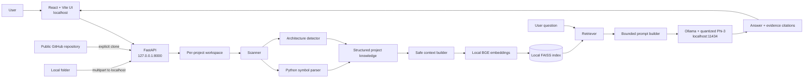

# CodeAtlas Architecture

## System boundary

CodeAtlas is a localhost web application. The React UI, FastAPI analysis service, embedding model, FAISS index, and Ollama LLM all execute on the user's machine. GitHub is contacted only when the user explicitly imports a public repository. Hugging Face and the Ollama model registry are contacted only for initial model downloads.



## Data flow

1. The user chooses a public GitHub URL or local folder.
2. The backend creates `backend/workspace/{project_id}/source/` and copies or clones the repository there.
3. The scanner produces file, directory, size, language, and basic health metadata.
4. The Python parser extracts imports, classes, and functions. The architecture detector scores manifests, paths, file patterns, imports, and known frameworks.
5. The frontend renders the detected evidence, repository metrics, reading guide, and a 3D top-level-area map.
6. On the first chat request, the context builder creates structured documents and bounded source excerpts while excluding sensitive/generated content.
7. SentenceTransformers generates normalized embeddings locally. FAISS stores and searches them locally.
8. Retrieved evidence, architecture metadata, and the question are fitted into a bounded prompt.
9. Ollama runs `phi3:latest` locally and returns an answer. CodeAtlas returns evidence file paths and line ranges with the response.

## Components

| Component | Technology | Responsibility |
|---|---|---|
| Frontend | React 19, TypeScript, Vite | Import workflow, dashboard, 3D Galaxy, chat |
| 3D visualization | Three.js | Interactive scan-derived repository planets |
| API | FastAPI, Uvicorn | Local orchestration and project endpoints |
| Scanner | Python | File traversal, language and repository metrics |
| Parser | Python AST/Tree-sitter stack | Current Python symbol extraction |
| Architecture detector | Rule registry and scored signals | Evidence-based category/framework detection |
| Context builder | Python | Structured evidence and safe bounded source chunks |
| Embeddings | BAAI/bge-small-en-v1.5 | Local semantic vectors |
| Vector index | FAISS CPU | Local similarity search |
| LLM runtime | Ollama | Local model lifecycle and generation API |
| Generative model | Phi-3 Mini, Q4_0 in tested Ollama build | Evidence-grounded answers |

## Key design decisions

### Localhost instead of a hosted backend

Repository processing must remain on-device. Both API and Ollama default to loopback addresses. This also keeps the prototype easy to inspect and run with standard web tooling.

### Structured-first hybrid RAG

Architecture claims rely first on generated scan metadata and symbols. Small source excerpts are retrieved only for implementation questions. This produces more useful answers than metadata-only retrieval while avoiding indiscriminate ingestion of entire repositories.

### Lazy indexing

Scanning and visualization do not wait for embeddings. The FAISS index is created on the first chat request and then reused, keeping the non-AI dashboard responsive.

### Truthful visualization

The Galaxy is driven by real scanned folders, file counts, languages, and sizes. Until dependency extraction exists, edges are described as containment rather than dependencies.

### Bounded local generation

The prompt is capped for Phi-3's local context, output length is bounded, and Ollama keeps the model warm between questions. This reduces CPU latency and prevents misleading connection errors when generation is merely slow.

## Storage

```text
backend/workspace/{project_id}/
├── source/                 copied or cloned repository
├── cache/
│   ├── scan_result.json
│   ├── health.json
│   ├── symbols.json
│   ├── architecture.json
│   ├── project_summary.json
│   └── knowledge.json
└── embeddings/
    ├── index.bin
    └── documents.json
```

No automatic cloud synchronization exists. Users should delete project workspace directories when local retention is no longer desired.

## Trust boundaries and risks

- The backend trusts the local user and local Ollama daemon.
- Remote `OLLAMA_BASE_URL` configuration weakens the on-device guarantee.
- Git cloning requires network access and executes the installed Git client, but CodeAtlas does not execute imported project code.
- ZIP traversal and unsafe browser paths are rejected.
- Common secrets, keys, generated assets, binaries, lockfiles, and oversized files are excluded from AI context.
- Generated answers can still be incomplete or incorrect; retrieved citations should be inspected for important decisions.

## Current limitations

- Python-only symbol extraction.
- No dependency or call graph.
- What-if engine is not implemented.
- No private GitHub OAuth.
- No automatic workspace deletion UI.
- CPU-only generation can take tens of seconds.
