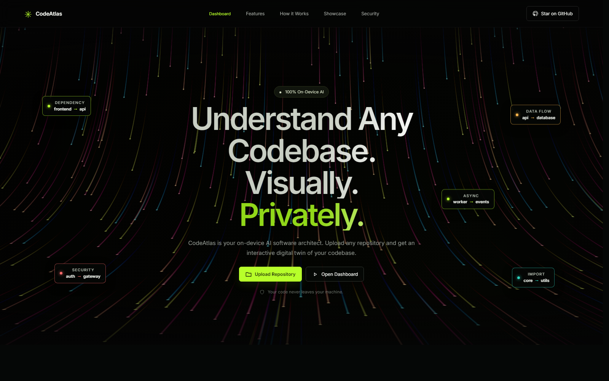

# CodeAtlas

**Understand unfamiliar codebases visually, privately, and with local AI.**

[](https://unstop.com/hackathons/osdhack-2026-open-source-developers-communityosdc-1693803)
[](https://www.python.org/)
[](https://ollama.com/)
[](LICENSE)

> **Demo video:** `PASTE THE FINAL 2–3 MINUTE VIDEO LINK HERE BEFORE SUBMISSION`

CodeAtlas is a localhost application that imports a public GitHub repository or local project folder, scans its structure, detects architecture signals, renders a scan-derived interactive 3D galaxy, and answers codebase questions using a fully local RAG pipeline. Repository evidence is embedded locally with BAAI/bge-small-en-v1.5, retrieved from a local FAISS index, and sent only to a local Phi-3 model through Ollama.



## Why it matters

Developers joining an unfamiliar project spend hours locating entry points, frameworks, important folders, and architectural boundaries. Cloud code assistants can introduce privacy and compliance concerns. CodeAtlas provides an offline-capable exploration workflow whose core AI inference and repository processing remain on the user's computer.

## Working features

- Import a public GitHub repository or select a local project folder.
- Scan real file paths, sizes, directories, languages, empty files, and largest files.
- Detect backend, frontend, mobile, database, API, AI, testing, Docker, CI, documentation, and known frameworks using scored evidence.
- Explore top-level repository areas in an interactive Three.js 3D galaxy.
- Generate a scan-derived reading guide and repository metrics.
- Ask evidence-grounded questions through local semantic retrieval and `phi3:latest`.
- Display retrieved file and line-range citations when source evidence is available.
- Exclude secrets, lockfiles, generated folders, binaries, oversized files, and common credential formats from AI source context.

The current Galaxy links represent **folder containment**, not code dependencies. The What-if screen is explicitly marked as a concept preview. See [Known limitations](#known-limitations).

## Quick start (Windows PowerShell)

### Prerequisites

- Git
- Python `3.12.x`
- Node.js `20+` and npm
- [`uv`](https://docs.astral.sh/uv/)
- [Ollama](https://ollama.com/)
- At least 4 GB free disk space for dependencies and local models

### 1. Clone and install

```powershell
git clone https://github.com/Hazardo911/CodeAtlas.git
cd CodeAtlas

pip install uv
uv sync --locked

cd frontend
npm ci
cd ..
```

### 2. Download the local LLM

Open Ollama from the Windows Start menu, then run:

```powershell
ollama pull phi3:latest
ollama list
```

`phi3:latest` is approximately 2.2 GB in the tested Ollama build. If `ollama serve` reports that port `11434` is already in use, Ollama is already running.

### 3. Configure the backend

```powershell
Copy-Item backend\.env.example backend\.env
```

The defaults bind all services to loopback. Do not point `OLLAMA_BASE_URL` at a remote host if you require strict on-device processing.

### 4. Run the backend

```powershell
cd backend
& ..\.venv\Scripts\python.exe -m uvicorn app.main:app --host 127.0.0.1 --port 8000
```

Wait for `Application startup complete`. Swagger is available at <http://127.0.0.1:8000/docs>.

### 5. Run the frontend

In a second terminal, enter the cloned repository's frontend directory:

```powershell
cd <clone-path>\CodeAtlas\frontend
npm run dev
```

Open the Vite URL shown in the terminal, normally <http://localhost:5173>.

### 6. Verify local AI

With the backend running:

```powershell
Invoke-RestMethod http://127.0.0.1:8000/ai/status
```

Expected fields:

```text
available       : True
model_available : True
model           : phi3:latest
provider        : Ollama
```

## Sample input and expected output

1. Click **Upload Repository**.
2. Paste a public URL such as `https://github.com/tiangolo/full-stack-fastapi-template`, or choose **Local folder**.
3. Wait for upload/clone, scan, and architecture detection to finish.
4. Open the dashboard.

Expected results:

- **Architecture:** detected categories, confidence, and matched evidence.
- **Galaxy:** interactive planets derived from scanned top-level areas.
- **Repository:** real file, directory, size, language, and empty-file metrics.
- **Onboarding:** suggested README, manifest, entry-point, and large-file reading order.
- **AI Chat:** a local answer plus retrieved file/line citations where available.

Suggested questions:

```text
Give me a project overview.
Which frameworks are detected?
Where should I start reading?
Explain the purpose of the API routes.
```

The first chat request builds the local embedding index and can take longer. On the tested CPU-only device, an already-indexed project answered a bounded overview request in approximately 42 seconds.

## On-device AI verification

| Component | Location | Internet required? | Repository data leaves device? |
|---|---|---:|---:|
| Scanner and architecture detector | Local FastAPI process | No | No |
| Embeddings (`BAAI/bge-small-en-v1.5`) | Local SentenceTransformers runtime | Only for first model download | No |
| Vector search | Local FAISS files | No | No |
| Answer generation (`phi3:latest`) | Local Ollama process | Only for first model download | No |
| GitHub import | Git client to GitHub | Yes, to download a public repository | No repository upload |
| Local-folder import | Browser to localhost backend | No | No |

After the embedding model and Phi-3 are cached, repository analysis and AI chat can run offline. CodeAtlas has no cloud backend and uses no hosted LLM API.

## Architecture

```text
GitHub URL / local folder
          |
          v
React + Vite UI (localhost)
          |
          v
FastAPI ingestion -> scanner -> Python symbol parser -> architecture detector
          |                                      |
          |                                      +-> dashboard + 3D galaxy
          v
structured metadata + bounded safe source excerpts
          |
          v
local BGE embeddings -> local FAISS retrieval -> bounded grounded prompt
          |
          v
Ollama on localhost -> quantized Phi-3 -> answer + evidence citations
```

See [ARCHITECTURE.md](ARCHITECTURE.md) for the full data flow and design decisions, and [docs/TECHNICAL_REPORT.md](docs/TECHNICAL_REPORT.md) for runtime details, evaluation, privacy, safety, attribution, and failure cases.

## Tests

```powershell
cd CodeAtlas
cd backend
& ..\.venv\Scripts\python.exe -m unittest test_ai_context.py test_ignore.py -v

cd ..\frontend
npm run lint
npm run build
```

## API summary

| Method | Endpoint | Purpose |
|---|---|---|
| `GET` | `/health` | Backend health check |
| `GET` | `/ai/status` | Ollama and configured-model status |
| `POST` | `/projects/upload` | ZIP import |
| `POST` | `/projects/upload-files` | Browser-selected folder import |
| `POST` | `/projects/upload-github` | Public GitHub clone |
| `POST` | `/projects/{id}/scan` | Repository scan and symbol extraction |
| `POST` | `/projects/{id}/architecture` | Architecture detection |
| `POST` | `/projects/{id}/chat` | Local project-grounded AI chat |

## Known limitations

- Symbol extraction is currently Python-only; other languages still contribute file, manifest, path, import-text, and framework signals.
- Dependency and call graphs are not implemented. Galaxy edges currently show containment.
- What-if impact simulation is a labelled UI preview without a backend engine.
- Public GitHub HTTPS URLs are supported; private-repository OAuth is not implemented.
- Local CPU inference is slower than hosted GPU APIs and answer quality is bounded by Phi-3 and retrieved evidence.
- Citations show retrieved evidence, not formal proof that every generated statement is correct.
- Uploaded repositories are copied into `backend/workspace/` until manually removed.

## Submission documents

- [Architecture](ARCHITECTURE.md)
- [Technical report, evaluation, privacy, and attribution](docs/TECHNICAL_REPORT.md)
- [2–3 minute demo recording script](docs/DEMO_SCRIPT.md)
- [Final submission checklist](docs/SUBMISSION_CHECKLIST.md)

## License

CodeAtlas is released under the [MIT License](LICENSE).
